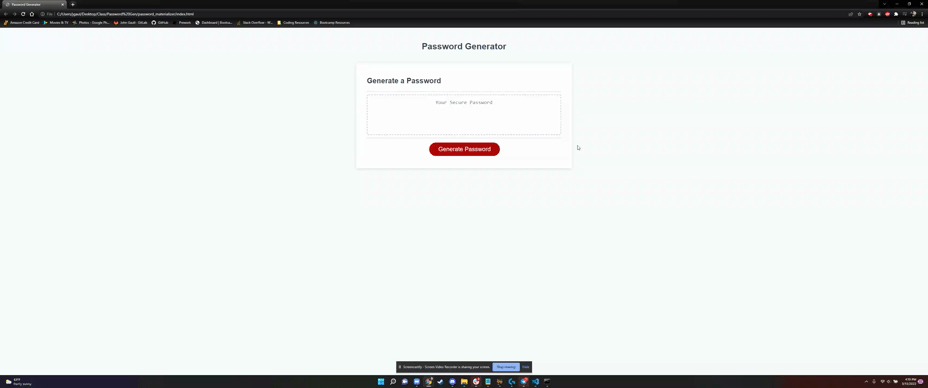

# password_materializer

This project is part of our week-three homework.
For this assignement we are to use Javascript to develop a rudimentary password generator that is dynamically adaptable based on user input. This homework involves using JS with 'if' statements, array concatenation, and global vs local variables. 

